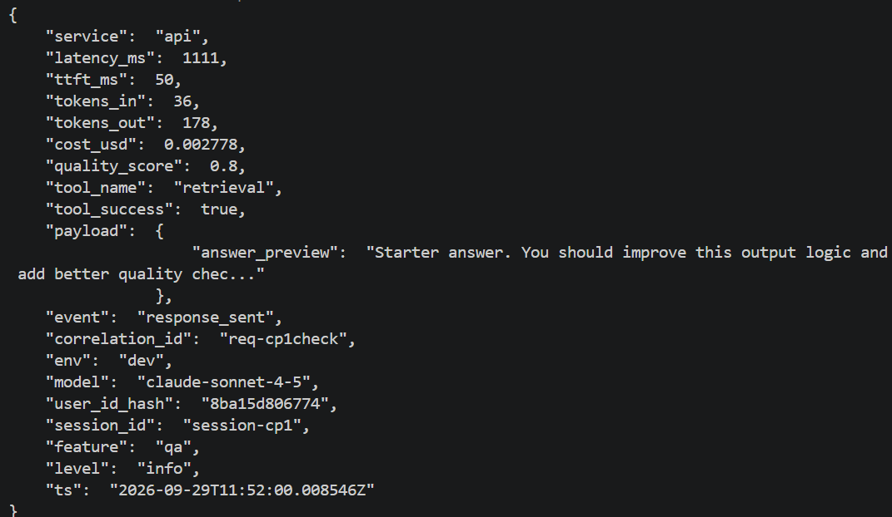
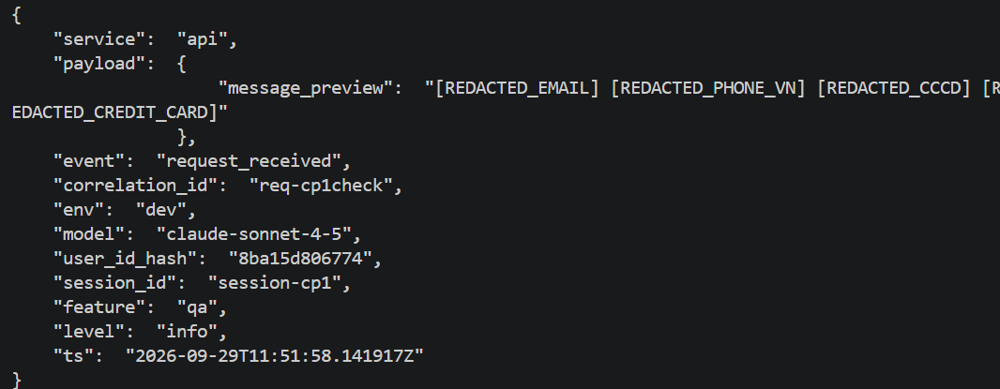

# Báo cáo cá nhân — K4-L3A Day 13 Monitoring & LLMOps

> Mỗi học viên hoàn thiện một file duy nhất này. Khi dẫn evidence, dùng đường dẫn tương đối, ví dụ `evidence/07-trace-waterfall.png`.

## 1. Thông tin học viên

- **Họ và tên:** Nguyễn Quang Huy
- **MSSV:** 2A202602820
- **Lớp:** K4-L3A
- **Repository URL:** https://github.com/hshdhu/K4-L3-DAY13-NguyenQuangHuy-2A202602820-Monitoring-LLMOps
- **Commit SHA cuối:**
- **Challenge ID:**
- **Tên project Langfuse cá nhân:** `day13-k4-l3a-2A202602820`

## 2. Evidence index

Điền đúng đường dẫn tới evidence thực tế. Có thể đổi tên hoặc dùng nhiều ảnh nếu cần.

| Evidence | Đường dẫn |
|---|---|
| Baseline CP0 | [cp0-baseline.txt](evidence/cp0-baseline.txt) |
| Pytest cuối | `evidence/01-pytest.png` |
| Log validator | `evidence/02-log-validator.png` |
| Dashboard validator | `evidence/03-dashboard-validator.png` |
| Structured log | [04-structured-log.png](evidence/04-structured-log.png) |
| PII redaction | [05-pii-redaction.png](evidence/05-pii-redaction.png) |
| Trace list | `evidence/06-trace-list.png` |
| Trace waterfall | `evidence/07-trace-waterfall.png` |
| Trace metadata | `evidence/08-trace-metadata.png` |
| Prompt versions | `evidence/09-prompt-versions.png` |
| Prompt rollback | `evidence/10-prompt-rollback.png` |
| Dashboard runtime | `evidence/11-dashboard-overview.png` |
| Incident metric | `evidence/12-incident-metric.png` |
| Incident log | `evidence/13-incident-log.png` |
| Incident trace | `evidence/14-incident-trace.png` |

## 3. Kết quả kỹ thuật

| Nội dung | Baseline | Kết quả cuối | Nhận xét |
|---|---|---|---|
| `validate_logs.py` | 30/100; 21 records; 20 thiếu trường bắt buộc; 20 thiếu context; 0 correlation ID hợp lệ | | Correlation ID và log enrichment chưa triển khai ở CP0. |
| `validate_dashboard.py` | HỢP LỆ: 6/6 panel | | Chỉ xác nhận dashboard contract, chưa xác nhận dashboard runtime. |
| `pytest` | 22 passed in 1.97s | | Kết quả chạy baseline. |
| Số traces hợp lệ | Danh sách Langfuse đã xuất hiện 10 dòng root observation `lab-agent-run` | | Chưa đạt tiêu chí trace hoàn chỉnh CP2: correlation ID còn `MISSING`, chưa có child retrieval/generation; chưa ghi trace IDs. |
| Số PII leak | Validator phát hiện 0 trong 21 records | | Kết quả trên workload baseline; chưa chứng minh toàn bộ pipeline PII đã hoàn thiện. |
| Latency P95 / TTFT P95 | | | |
| Retrieval success rate | | | |

Ghi nhận CP0 ngày 29/09/2026, khoảng 18:16–18:17 (UTC+7): API khởi động thành công, load test có 10/10 request trả HTTP 200 và đã tạo `data/logs.jsonl`. Đã kiểm tra `/health`, trả HTTP 200 với `ok: true`. Output baseline được lưu tại [evidence/cp0-baseline.txt](evidence/cp0-baseline.txt).

Langfuse đã nhận root observations của workload. Prompt `day13-chat` với label `production` chưa tìm thấy (404), nên ứng dụng dùng `prompt_source=local-fallback`, `prompt_version=local-v1`; các request vẫn thành công. Prompt versioning sẽ được hoàn thiện ở CP2.

## 4. Logging và PII

- **Cách tạo/nhận và truyền correlation ID:** Middleware xóa context đầu request, nhận `x-request-id` hoặc sinh `req-<8-hex>`, bind vào structlog và lưu trong request state. Response trả cùng ID qua header/body, kèm `x-response-time-ms`; context được dọn trong `finally`.
- **Các metadata được ghi vào structured log:** Bind `user_id_hash` (SHA-256 rút gọn), `session_id`, `feature`, `model`, `env` trước `request_received`. Các log của request dùng chung correlation ID và context.
- **Cách bảo đảm PII được scrub trước khi ghi:** `scrub_event` xử lý chuỗi trong các field, dictionary/list lồng nhau; chạy sau formatter exception và trước file writer/JSON renderer. Regex che email, điện thoại Việt Nam, CCCD và số thẻ 16 chữ số (liền, cách hoặc gạch nối).
- **Cách kiểm chứng kết quả:** Workload CP1 ban đầu có 10/10 HTTP 200, validator 100/100, 10 ID duy nhất, không thiếu field/context và không phát hiện PII; 31 tests passed. Request có ID `req-abcdef12` trả đúng ID trong header/body và thời gian 1221.44 ms.

Kiểm tra bổ sung phát hiện regex thẻ cũ ghép CCCD với nhóm đầu số thẻ khi hai giá trị đứng liền nhau, để sót phần đuôi. Đã sửa regex để nhận số thẻ liền hoặc các nhóm bốn chữ số có dấu phân cách nhất quán, thêm regression test cho cả bốn loại PII trong một chuỗi.

Sau sửa, kiểm tra trực tiếp API lúc khoảng 18:52 ngày 29/09/2026 (UTC+7) cho log preview: `[REDACTED_EMAIL] [REDACTED_PHONE_VN] [REDACTED_CCCD] [REDACTED_CREDIT_CARD]`. Request kiểm tra có correlation ID `req-cp1check`, header thời gian 1872.30 ms. Validator trên 27 records đạt **100/100**, có **12 correlation IDs**, **0 thiếu field/context**, **0 PII leaks được phát hiện**. Tests đạt **32 passed in 2.45s**, gồm kiểm tra context isolation, headers và redaction trước khi ghi file/terminal. Đây là kết quả CP1, chưa thay thế evidence cuối bài; log cũ được giữ nguyên khi kiểm tra.

## 5. Tracing và prompt versioning

- **Cách xác nhận traces do chính tôi tạo trong project cá nhân:**
- **Cấu trúc root/retrieval/generation observations:**
- **Cách nối trace với log:**
- **Prompt name:**
- **Version/label baseline:**
- **Version/label candidate:**
- **Trace ID của mỗi version:**
- **Cách promote và rollback `production`:**

## 6. Dashboard, SLO và alerts

- **Dashboard và sáu panel:**
- **SLO và lý do chọn:**
- **Cách tính error budget:**
- **Ba alert và runbook tương ứng:**

## 7. Điều tra challenge

- **Challenge ID:**
- **Khoảng thời gian điều tra:**
- **Triệu chứng từ metrics:**
- **Log line và correlation ID liên quan:**
- **Trace ID và span gây ảnh hưởng:**
- **Root cause:**
- **Fix action:**
- **Preventive measure:**

## 8. Giải thích và tự đánh giá

- **Một quyết định kỹ thuật quan trọng và lý do:**
- **Một lỗi/blocker đã gặp:**
- **Cách tìm nguyên nhân và xử lý:**
- **Cách hiểu luồng Metrics → Logs → Traces:**
- **Vai trò của prompt version, token/cost, SLO hoặc rollback trong vận hành LLM:**
- **Điều quan trọng nhất đã học:**
- **Hạn chế hoặc phần chưa hoàn thành, nếu có:**

## 9. Checklist trước khi nộp

- [ ] Kết quả và evidence thuộc commit SHA cuối.
- [ ] Tất cả ảnh/output mở được bằng đường dẫn tương đối.
- [ ] Incident evidence nối đúng metric → log → trace.
- [ ] Trace/prompt evidence thuộc project Langfuse cá nhân và ảnh không lộ key/secret.
- [ ] Repository chạy lại được theo README.
- [ ] Không có secret, API key, PII thô hoặc evidence của người khác/lớp khác.
- [ ] URL repo và commit SHA cuối đã được nộp trên LMS/Codelabs.
