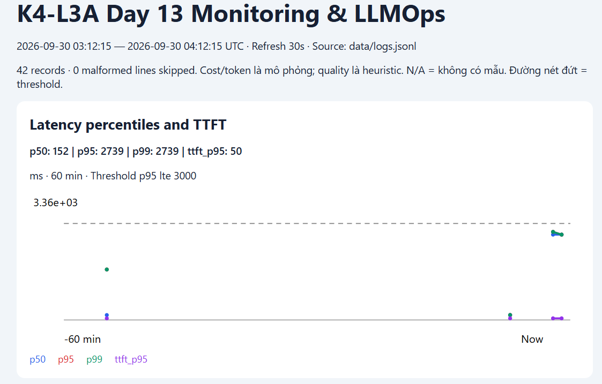
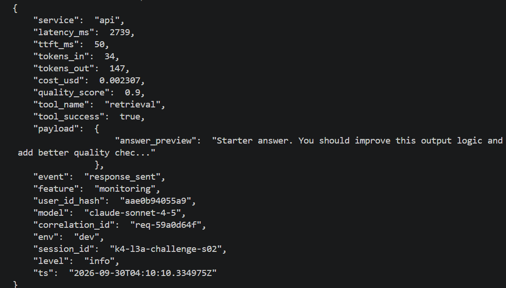
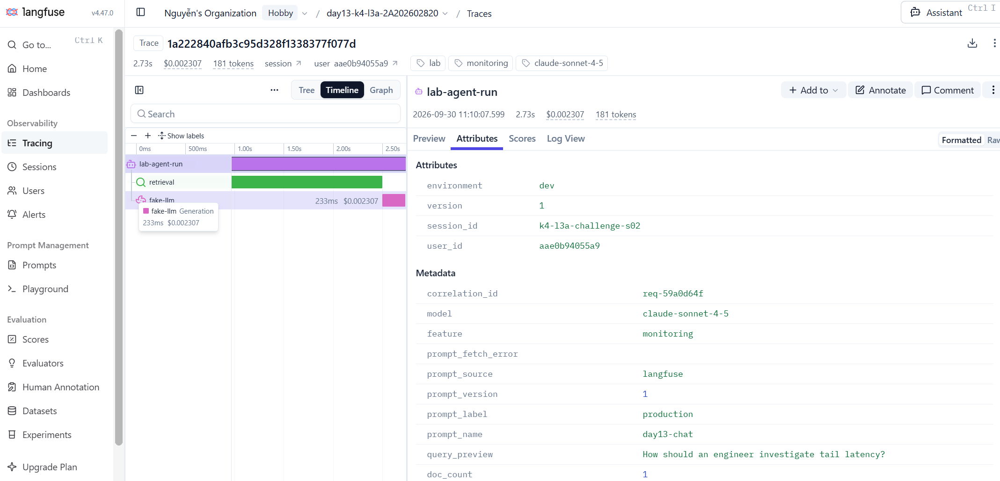

# Báo cáo cá nhân — K4-L3A Day 13 Monitoring & LLMOps

> Báo cáo ghi nhận các lần chạy thực tế CP0–CP4. SHA của bản nộp được lấy sau khi tạo commit chứa báo cáo này.

## 1. Thông tin học viên

- **Họ và tên:** Nguyễn Quang Huy
- **MSSV:** 2A202602820
- **Lớp:** K4-L3A
- **Repository URL:** https://github.com/hshdhu/K4-L3-DAY13-NguyenQuangHuy-2A202602820-Monitoring-LLMOps
- **Commit nộp:** Commit chứa phiên bản báo cáo và toàn bộ evidence này. SHA đầy đủ lấy bằng `git rev-parse HEAD` sau khi commit và nộp cùng URL repo trên LMS; SHA chỉ được xác định sau khi tạo commit, không ghi SHA của commit trước thay thế.
- **Challenge ID:** `day13-k4-l3a-monitoring-llmops-v1`
- **Tên project Langfuse cá nhân:** `day13-k4-l3a-2A202602820`

## 2. Evidence index

Tests/validators dùng output text; các bằng chứng runtime dùng ảnh bên dưới.

| Evidence | Đường dẫn |
|---|---|
| Baseline CP0 | [cp0-baseline.txt](evidence/cp0-baseline.txt) |
| Pytest cuối | [01-pytest.txt](evidence/01-pytest.txt) |
| Log validator | [02-log-validator.txt](evidence/02-log-validator.txt) |
| Dashboard validator | [03-dashboard-validator.txt](evidence/03-dashboard-validator.txt) |
| Structured log | [04-structured-log.png](evidence/04-structured-log.png) |
| PII redaction | [05-pii-redaction.png](evidence/05-pii-redaction.png) |
| Trace list | [06-trace-list.png](evidence/06-trace-list.png) |
| Trace waterfall | [Waterfall đầy đủ: root, retrieval, generation](evidence/14-incident-trace.png) |
| Trace metadata | [08-trace-metadata.png](evidence/08-trace-metadata.png) |
| Prompt versions | [09-prompt-versions.png](evidence/09-prompt-versions.png) |
| Prompt rollback | [Promote v2](evidence/10a-production-v2.png), [Rollback v1](evidence/10b-rollback-v1.png) |
| Dashboard runtime | [Dashboard 11a](evidence/11a-dashboard-overview.png), [Dashboard 11b](evidence/11b-dashboard-overview.png) |
| Incident metric | [12-incident-metric.png](evidence/12-incident-metric.png) |
| Incident log | [13-incident-log.png](evidence/13-incident-log.png) |
| Incident trace | [14-incident-trace.png](evidence/14-incident-trace.png) |

## 3. Kết quả kỹ thuật

| Nội dung | Baseline | Kết quả cuối | Nhận xét |
|---|---|---|---|
| `validate_logs.py` | 30/100; 21 records; 20 thiếu trường bắt buộc; 20 thiếu context; 0 correlation ID hợp lệ | 100/100; 193 records; 89 correlation IDs; 0 thiếu field/context | Output kiểm tra CP4 ở evidence 02. |
| `validate_dashboard.py` | HỢP LỆ: 6/6 panel | HỢP LỆ: 6/6 panel | Contract pass; ảnh 11a/11b chứng minh runtime. |
| `pytest` | 22 passed in 1.97s | 36 passed in 3.04s | Output kiểm tra CP4 ở evidence 01. |
| Số traces hợp lệ | 10 dòng root observation; ID còn MISSING, chưa có child spans | 10 Trace IDs thật được liệt kê ở mục 5 | Đối chiếu API Langfuse và correlation IDs trong log; không dùng tổng observations thay số traces. |
| Số PII leak | Validator phát hiện 0 trong 21 records | Validator phát hiện 0 trong 193 records | Giới hạn theo pattern detector; không khẳng định bao phủ mọi dạng PII. |
| Latency P95 / TTFT P95 | Không lưu snapshot P95 CP0 | 1569 / 50 ms ở ảnh 11a; khi incident 2739 / 50 ms ở ảnh 12 | Hai cửa sổ khác nhau; sau mitigation latency từng request 152–154 ms, không trộn với P95 60 phút. |
| Retrieval success rate | Không lưu snapshot CP0 | 100% trong ảnh 11a/11b | Tool chạy thành công chưa chứng minh tài liệu truy xuất có liên quan. |

Ghi nhận CP0 ngày 29/09/2026, khoảng 18:16–18:17 (UTC+7): API khởi động thành công, load test có 10/10 request trả HTTP 200 và đã tạo `data/logs.jsonl`. Đã kiểm tra `/health`, trả HTTP 200 với `ok: true`. Output baseline được lưu tại [evidence/cp0-baseline.txt](evidence/cp0-baseline.txt).

Langfuse đã nhận root observations của workload. Prompt `day13-chat` với label `production` chưa tìm thấy (404), nên ứng dụng dùng `prompt_source=local-fallback`, `prompt_version=local-v1`; các request vẫn thành công. Prompt versioning sẽ được hoàn thiện ở CP2.

## 4. Logging và PII

- **Cách tạo/nhận và truyền correlation ID:** Middleware xóa context đầu request, nhận `x-request-id` hoặc sinh `req-<8-hex>`, bind vào structlog và lưu trong request state. Response trả cùng ID qua header/body, kèm `x-response-time-ms`; context được dọn trong `finally`.
- **Các metadata được ghi vào structured log:** Bind `user_id_hash` (SHA-256 rút gọn), `session_id`, `feature`, `model`, `env` trước `request_received`. Các log của request dùng chung correlation ID và context.
- **Cách bảo đảm PII được scrub trước khi ghi:** `scrub_event` xử lý chuỗi trong các field, dictionary/list lồng nhau; chạy sau formatter exception và trước file writer/JSON renderer. Regex che email, điện thoại Việt Nam, CCCD và số thẻ 16 chữ số (liền, cách hoặc gạch nối).
- **Cách kiểm chứng kết quả:** Workload CP1 ban đầu có 10/10 HTTP 200, validator 100/100, 10 ID duy nhất, không thiếu field/context và không phát hiện PII; 31 tests passed. Request có ID `req-abcdef12` trả đúng ID trong header/body và thời gian 1221.44 ms.

Kiểm tra bổ sung phát hiện regex thẻ cũ ghép CCCD với nhóm đầu số thẻ khi hai giá trị đứng liền nhau, để sót phần đuôi. Đã sửa regex để nhận số thẻ liền hoặc các nhóm bốn chữ số có dấu phân cách nhất quán, thêm regression test cho cả bốn loại PII trong một chuỗi.

Sau sửa, kiểm tra trực tiếp API lúc khoảng 18:52 ngày 29/09/2026 (UTC+7) cho log preview: `[REDACTED_EMAIL] [REDACTED_PHONE_VN] [REDACTED_CCCD] [REDACTED_CREDIT_CARD]`. Request kiểm tra có correlation ID `req-cp1check`, header thời gian 1872.30 ms. Validator trên 27 records đạt **100/100**, có **12 correlation IDs**, **0 thiếu field/context**, **0 PII leaks được phát hiện**. Tests đạt **32 passed in 2.45s**, gồm kiểm tra context isolation, headers và redaction trước khi ghi file/terminal. Đây là kết quả CP1, chưa thay thế evidence cuối bài; log cũ được giữ nguyên khi kiểm tra.

## 5. Tracing và prompt versioning

- **Cách xác nhận traces do chính tôi tạo trong project cá nhân:** Đối chiếu correlation IDs từ workload/log với metadata trên Langfuse; ảnh 06 lọc `isRootObservation:true` và hiển thị tên project cá nhân, trên 10 dòng root. Danh sách Trace IDs cụ thể nằm dưới đây.
- **Cấu trúc root/retrieval/generation observations:** Root `lab-agent-run` (agent) chứa `retrieval` (retriever) và `fake-llm` (generation). Cả ba tắt capture tự động input/output. Generation ghi model, preview đã scrub, usage input/output, cost mô phỏng và thời điểm token đầu tiên; kế thừa managed prompt từ `propagate_attributes`.
- **Cách nối trace với log:** Tìm `correlation_id` của log trong trace metadata; trace có user ID đã hash, session, feature, model và environment. Tests kiểm tra quan hệ cha-con và không capture email thô.
- **Prompt name:** `day13-chat`; lấy theo label trong `.env`, có local fallback khi fetch lỗi. Fallback không được coi là evidence versioning.
- **Version/label baseline:** Đã đặt `LANGFUSE_PROMPT_LABEL=baseline` và chạy workload, 10/10 request HTTP 200. Nội dung observations trên Langfuse ngày 30/09/2026 xác nhận 8 request dùng `prompt_source=langfuse`, `prompt_name=day13-chat`, `prompt_label=baseline`, `prompt_version=1`, không có prompt fetch error. Hai request đầu (`req-3886df53`, `req-4400b3c5`) dùng `local-fallback` / `local-v1` với `LangfuseFallback`, không tính là evidence dùng managed prompt v1.
- **Version/label candidate:** Đã chạy cùng workload với label `candidate`, 10/10 request HTTP 200. Observations ngày 30/09/2026 xác nhận cả 10 request dùng `prompt_source=langfuse`, `prompt_label=candidate`, `prompt_version=2`, không có prompt fetch error. Generation liên kết `day13-chat (v2)`.
- **Trace ID của mỗi version:** Baseline v1 (label `baseline`): `31da365acaee3884ce2a253bce284e91`, tương ứng correlation ID `req-ed0a7914`. Candidate v2 (label `candidate`): `b20d564a8635caf9e426d493a2f9f781`, tương ứng correlation ID `req-c6898306`.
- **Cách promote và rollback `production`:** Chuyển label production sang v2, restart API và chạy workload; ảnh 10a xác nhận `prompt_source=langfuse`, `prompt_label=production`, `prompt_version=2`, correlation ID `req-66657a04`. Sau đó chuyển production về v1, restart và chạy lại; ảnh 10b xác nhận version 1, correlation ID `req-1243cda6`. Giữ nguyên source khi đổi label.

| Mục đích | Correlation ID | Trace ID |
|---|---|---|
| Baseline v1 | `req-ed0a7914` | `31da365acaee3884ce2a253bce284e91` |
| Candidate v2 | `req-c6898306` | `b20d564a8635caf9e426d493a2f9f781` |
| Promote production v2 | `req-66657a04` | `8be03701c6e942bfd6e263b1b4bead83` |
| Rollback production v1 | `req-1243cda6` | `76f0ffc06ef4b21a465e41699a4b797a` |
| Incident CP3 | `req-59a0d64f` | `1a222840afb3c95d328f1338377f077d` |
| Phục hồi CP3, production v1 | `req-dce0a51d` | `dec1e1334d5e0a41fa713624977d86b1` |
| Phục hồi CP3, production v1 | `req-2904a7af` | `805d387b598d84ef7324ae72b4b37714` |
| Phục hồi CP3, production v1 | `req-615e4aab` | `b22a52eaa21a02d0045834951bd069e9` |
| Phục hồi CP3, production v1 | `req-286ca62f` | `7906508f0428a0e6f89b39ddd9db70dc` |
| Phục hồi CP3, production v1 | `req-81e8fd58` | `3ce3ea52792016e0c7dd0a6d0b491d82` |

Đã đọc trực tiếp cả 10 Trace IDs qua Observations API của project Langfuse đã cấu hình, xác nhận correlation ID, label/version và parentObservationId: mỗi root có hai child retrieval và fake-llm. Năm trace phục hồi khớp log sau mitigation. Dùng ảnh 14 làm evidence waterfall chính cho cả CP2 và CP3 vì ảnh có đầy đủ root/retrieval/generation và correlation ID. Ảnh 07 là góc nhìn phóng to của trace rollback, chỉ dùng bổ sung.

Kết quả workload khi cấu hình label `baseline` (output terminal):

| Correlation ID | Feature | HTTP | Thời gian phía client (ms) |
|---|---|---|---:|
| `req-3886df53` | qa | 200 | 8774.2 |
| `req-4400b3c5` | qa | 200 | 2505.1 |
| `req-f3bbfeb7` | summary | 200 | 1522.6 |
| `req-408a4983` | qa | 200 | 158.4 |
| `req-ccb63cc3` | qa | 200 | 161.3 |
| `req-7b94fc80` | summary | 200 | 159.7 |
| `req-57a50c89` | qa | 200 | 159.2 |
| `req-82b17366` | qa | 200 | 156.7 |
| `req-5414c283` | qa | 200 | 158.5 |
| `req-ed0a7914` | qa | 200 | 159.9 |

Ba request đầu chậm hơn bảy request sau (156.7–161.3 ms). Hai request đầu có lỗi fetch prompt và dùng fallback; chưa xác định nguyên nhân lỗi fetch hoặc toàn bộ thời gian chờ, cần đối chiếu log/waterfall. Thời gian trên là thời gian HTTP phía client, không phải trực tiếp `response_sent.latency_ms` dùng trong dashboard/SLO.

Request `req-ed0a7914` có các observations `lab-agent-run`, `retrieval` và `fake-llm` cùng correlation ID; generation liên kết `day13-chat (v1)`, model `claude-sonnet-4-5`, cost mô phỏng 0.002394 USD, TTFT 0.05 s và duration hiển thị 0.15 s. Trace ID đã ghi trong bảng trên.

Kết quả workload label `candidate` (output terminal):

| Correlation ID | Feature | HTTP | Thời gian phía client (ms) |
|---|---|---|---:|
| `req-06ff1cd3` | qa | 200 | 2004.1 |
| `req-0adb0693` | qa | 200 | 158.2 |
| `req-21116b45` | summary | 200 | 158.0 |
| `req-025bb57c` | qa | 200 | 157.6 |
| `req-dd8154d6` | qa | 200 | 160.0 |
| `req-832bac19` | summary | 200 | 158.5 |
| `req-27e56308` | qa | 200 | 158.3 |
| `req-9923cde5` | qa | 200 | 156.1 |
| `req-91110ba8` | qa | 200 | 157.8 |
| `req-c6898306` | qa | 200 | 160.2 |

Request `req-c6898306` có generation hiển thị model `claude-sonnet-4-5`, duration 0.15 s, TTFT 0.05 s, cost mô phỏng 0.001563 USD và liên kết prompt v2. Request đầu chậm hơn các request sau; chưa kết luận v2 cải thiện latency so với v1 vì hai lần chạy có trạng thái fetch/cache khác nhau. Promote/rollback được chứng minh bằng ảnh 10a/10b.

## 6. Dashboard, SLO và alerts

- **Dashboard và sáu panel:** Mở `/dashboard` trên API. Nguồn `data/logs.jsonl`, cửa sổ 60 phút UTC, refresh 30 giây; gồm latency P50/P95/P99 và TTFT P95, traffic, error rate/breakdown/retrieval success, cost, input/output tokens, quality proxy. Mỗi panel có đơn vị và threshold từ contract. Retrieval success tính trên cả response thành công và request lỗi; dữ liệu không có mẫu hiển thị N/A. Cost/token là mô phỏng, quality là heuristic. Hướng dẫn tại [DASHBOARD_SETUP.md](../docs/DASHBOARD_SETUP.md).
- **SLO và lý do chọn:** [slo.yaml](../config/slo.yaml): 99.5% request thành công trong 3000 ms trên 28 ngày. Baseline CP0 có latency 392–1182 ms trong 10 request, nên giữ ngưỡng lab 3000 ms; mẫu nhỏ chưa chứng minh SLO dài hạn.
- **Cách tính error budget:** N = số request_received; Good = số response_sent có latency_ms <= 3000. Budget = 0.005 × N; đã dùng = N − Good; còn lại = 0.005 × N − (N − Good). Ví dụ minh họa 10000 request cho phép 50 request không đạt, không phải số liệu thực tế của lab.
- **Ba alert và runbook tương ứng:** [alert_rules.yaml](../config/alert_rules.yaml) và [alerts.md](../docs/alerts.md): P95 > 3000 ms, error rate > 2%, cost ngày > 2.5 USD; mỗi rule có duration 5m, severity, owner và kênh Slack dự kiến. Đây là đặc tả, chưa triển khai evaluator/gửi Slack. Cost ngày và cost cửa sổ dashboard 60 phút là hai phép tính khác nhau.

Kiểm tra CP2 từng đạt 36 tests, dashboard validator 6/6 và log validator 100/100; kết quả CP4 cập nhật ở mục 3 và evidence 01–03. Dashboard runtime trong ảnh 11a/11b có cùng tổng cost 0.080856 USD, 40 requests, input/output tokens 1482/5094, quality 0.88, error rate 0%, retrieval success 100%; cửa sổ hiển thị ở ảnh 11a là 02:49:24–03:49:24 UTC ngày 30/09/2026. Đây là snapshot trước incident, không phải số liệu tại thời điểm kiểm tra CP4.

## 7. Điều tra challenge

- **Challenge ID:** `day13-k4-l3a-monitoring-llmops-v1`
- **Khoảng thời gian điều tra:** 30/09/2026, từ `04:10:06.6086286` đến `04:10:21.0822607` UTC (11:10:06–11:10:21 UTC+7). Bật incident thành công, `rag_slow=true`, hai incident còn lại tắt; workload challenge chạy concurrency 5.
- **Triệu chứng từ metrics:** Trước incident, 5/5 request HTTP 200, thời gian phía client 804.2–806.0 ms. Khi bật incident, vẫn 5/5 HTTP 200 nhưng client latency tăng lên 10725.4–13390.6 ms. Đối chiếu 5 log response_sent trong khoảng sự cố: latency_ms 2652–2739 ms, tất cả vượt ngưỡng challenge 2000 ms; TTFT đều 50 ms. Ảnh 12 ghi P95/P99 2739 ms và TTFT P95 50 ms trong cửa sổ 03:12:15–04:12:15 UTC; không nhầm client latency với latency_ms của agent.
- **Log line và correlation ID liên quan:** Chọn `req-59a0d64f`: `response_sent` tại `2026-09-30T04:10:10.334975Z`, feature `monitoring`, latency_ms `2739`, ttft_ms `50`. Các request còn lại: `req-f4c23716` (2654 ms), `req-2b83decd` (2653 ms), `req-55faffc1` (2652 ms), `req-9fbdcfd1` (2654 ms). Ảnh 13 và 14 xác nhận log và trace cùng request.
- **Trace ID và span gây ảnh hưởng:** `1a222840afb3c95d328f1338377f077d`, cùng correlation ID `req-59a0d64f`. Ảnh 14 xác nhận root khoảng 2.73 s, retrieval chiếm phần lớn thời gian (khoảng 2.5 s trên timeline), generation 233 ms. Trace bắt đầu 11:10:07.599 UTC+7, khớp log kết thúc 04:10:10.334975 UTC; prompt production v1 lấy thành công.
- **Root cause:** Incident `rag_slow` thêm `time.sleep(2.5)` vào retrieval trong `app/mock_rag.py`. Metric latency tăng, log vượt ngưỡng 2000 ms và waterfall tập trung thời gian ở retrieval cùng chứng minh nguyên nhân. TTFT vẫn 50 ms. Client latency 10.7–13.4 s còn bao gồm chờ xử lý; endpoint async gọi agent đồng bộ có sleep chặn event loop, nên không quy toàn bộ client latency cho một span retrieval.
- **Fix action:** Đã chạy `python scripts/inject_incident.py --disable`, cả ba incident false, rồi chạy lại cùng challenge với concurrency 5. Cả 5 request HTTP 200, client latency 575.4–888.1 ms. Log lúc 04:18:02 UTC xác nhận latency agent giảm còn 152–154 ms, TTFT 50 ms: `req-81e8fd58` (152), `req-286ca62f` (154), `req-615e4aab` (152), `req-2904a7af` (152), `req-dce0a51d` (152). Đã phục hồi trên workload kiểm tra; không sửa file challenge.
- **Preventive measure:** Đề xuất timeout và fallback có kiểm soát cho retrieval, theo dõi latency theo span/feature, cảnh báo tail latency kéo dài và kiểm thử tải concurrent. Đưa tác vụ blocking ra thread pool hoặc dùng client async khi triển khai thực tế để giảm chặn event loop. Đây là biện pháp đề xuất, chưa triển khai trong CP3.

Đối chiếu evidence CP3: ảnh 12 ghi cửa sổ 03:12:15–04:12:15 UTC, P50 152 ms, P95/P99 2739 ms, TTFT P95 50 ms. Cửa sổ chứa sự cố; đây là metric 60 phút, không chỉ riêng 5 request challenge. P95 vượt ngưỡng challenge 2000 ms nhưng chưa vượt SLO 3000 ms. Ảnh 13 và 14 khớp correlation ID, session và thời gian. Các yêu cầu đối chiếu nêu ở ghi nhận ban đầu phía trên đã được hoàn thành bằng ba ảnh dưới đây.

## 8. Giải thích và tự đánh giá

- **Một quyết định kỹ thuật quan trọng và lý do:** Đặt scrubber sau formatter exception nhưng trước file writer/JSON renderer, xử lý cả cấu trúc lồng nhau để che PII trước khi dữ liệu rời logger. Tắt automatic input/output capture trong tracing và chỉ ghi preview đã scrub. Triển khai trong [logging_config.py](../app/logging_config.py), [mock_llm.py](../app/mock_llm.py).
- **Một lỗi/blocker đã gặp:** Regex thẻ ban đầu ghép CCCD với nhóm đầu số thẻ khi hai giá trị đứng cạnh nhau; validator vẫn báo 100 vì không phát hiện phần đuôi bị sót.
- **Cách tìm nguyên nhân và xử lý:** Kiểm tra trực tiếp message_preview của request chứa cả bốn loại PII, sửa regex thẻ thành dạng liền hoặc nhóm bốn chữ số có dấu phân cách nhất quán; bổ sung regression test trong [test_pii.py](../tests/test_pii.py). Request kiểm tra sau sửa hiện đủ bốn dấu REDACTED.
- **Cách hiểu luồng Metrics → Logs → Traces:** Metric xác định triệu chứng/khoảng thời gian; log chọn request cụ thể bằng correlation ID; trace cùng ID cho biết retrieval chiếm phần lớn thời gian. Incident CP3 nối P95 2739 ms với log req-59a0d64f và span retrieval khoảng 2.5 s; chạy lại sau mitigation để kiểm chứng phục hồi.
- **Vai trò của prompt version, token/cost, SLO hoặc rollback trong vận hành LLM:** Version giúp truy nguyên nội dung prompt, label cho phép promote/rollback không đổi source; token/cost phân biệt tăng traffic với tăng chi phí từng request; SLO/error budget lượng hóa mức chất lượng chấp nhận được. FakeLLM trong lab chỉ mô phỏng usage/cost, không chứng minh chất lượng câu trả lời tốt hơn khi đổi prompt.
- **Điều quan trọng nhất đã học:** Validator pass chưa đủ; phải kiểm tra log/trace runtime, phân biệt thời gian HTTP phía client với latency agent, và dùng ba lớp evidence để kết luận nguyên nhân.
- **Hạn chế hoặc phần chưa hoàn thành, nếu có:** Dataset nhỏ, chưa chứng minh SLO 28 ngày; PII regex không bao phủ mọi dạng thông tin cá nhân; metric/log hiện chưa xử lý đầy đủ mọi lỗi validation/disconnect; agent đồng bộ có thể chặn event loop; alert là đặc tả, chưa có evaluator/gửi Slack. Phần tự đánh giá tổng hợp các quyết định và lỗi đã gặp trong quá trình thực hiện với hỗ trợ của AI coding assistant; học viên chịu trách nhiệm hiểu và giải thích bài nộp.

## 9. Checklist trước khi nộp

- [x] Kết quả và evidence thuộc commit SHA cuối.
- [x] Tất cả ảnh/output được dẫn bằng đường dẫn tương đối và đã kiểm tra file cục bộ.
- [x] Incident evidence nối đúng metric → log → trace.
- [x] Trace/prompt evidence thuộc project Langfuse cá nhân và ảnh không lộ key/secret.
- [x] Repository chạy lại được theo README.
- [x] Không có secret, API key, PII thô hoặc evidence của người khác/lớp khác.
- [x] URL repo và commit SHA cuối đã được nộp trên LMS/Codelabs.
